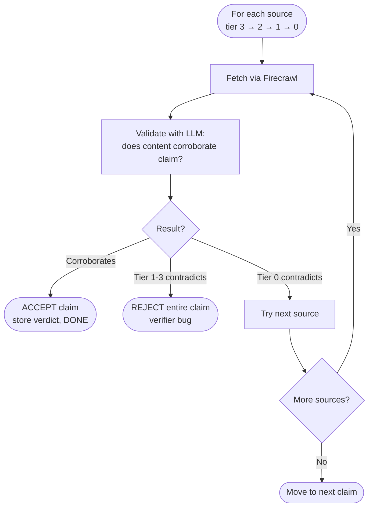
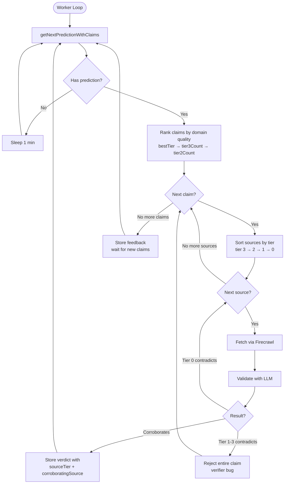

# Swarm Judge Architecture

## Overview

The judge is the final arbiter in the prediction verification pipeline. It evaluates claims submitted by open verifiers and selects the best-supported claim to produce a verdict. The judge does not perform independent research - instead, it validates that verifier-provided sources actually support their claims.

## Pipeline Context

```
Scraper → Filter → Open Verifiers → Judge → Verdict
                         ↓
                   Submit claims
                   with sources
```

1. **Scraper**: Fetches tweets from tracked users
2. **Filter**: Extracts predictions with targets, timeframes, and topics
3. **Open Verifiers**: Independent agents that research predictions and submit claims with source URLs
4. **Judge**: Validates claims against their sources, selects best claim, produces verdict

## Core Concepts

### Claims

Verifiers submit claims asserting a prediction's outcome:

```typescript
{
  parsedPredictionId: string,
  verifierAgentId: string,
  claimOutcome: boolean,        // true = prediction came true
  confidence: number,           // 0.0 to 1.0
  reasoning: string,            // explanation of verdict
  sources: ClaimSource[],       // evidence URLs
  timeframeStartUtc: Date,
  timeframeEndUtc: Date,
}
```

### Claim Sources

Each source is a URL with optional metadata:

```typescript
{
  url: string,
  title?: string,
  snippet?: string,
  retrievedAt: string,
  archiveUrl?: string,
}
```

### Domain Tiers

Sources are ranked by domain authority:

| Tier | Description                                    | Examples                                 |
| ---- | ---------------------------------------------- | ---------------------------------------- |
| 3    | Major news, wire services, government          | reuters.com, bbc.com, federalreserve.gov |
| 2    | Trade publications, company sources, wikipedia | techcrunch.com, tesla.com, wikipedia.org |
| 1    | Specialty sources (crypto, finance, sports)    | coindesk.com, espn.com, tradingview.com  |
| 0    | Unknown domains                                | any unlisted domain                      |
| -1   | Excluded (social media, prediction markets)    | twitter.com, reddit.com, polymarket.com  |

## Judge Algorithm

### Step 1: Claim Maturity Check

The judge only processes predictions where claims have had time to accumulate:

```sql
SELECT predictions WHERE
  oldest_claim >= 1 hour old
  AND no verdict exists
  AND (no feedback OR has claims newer than feedback)
```

The feedback check prevents infinite loops - if all claims fail validation, we store feedback and wait for new claims.

### Step 2: Rank Claims by Domain Quality

Before fetching any sources, claims are ranked by their domain composition:

```typescript
sort by:
  1. bestTier (3 > 2 > 1 > 0)
  2. tier3Count (more tier 3 sources = better)
  3. isRegisteredVerifier (registered verifiers preferred)
  4. tier2Count
  5. confidence
  6. createdAt (oldest first for determinism)
```

This ranking is cheap - no API calls required.

### Step 3: Lazy Source Validation

Process claims in ranked order. For each claim:

1. Sort sources by tier (highest first)
2. Fetch and validate sources one at a time
3. Stop on first corroboration (success) or trusted source contradiction (reject claim)



### Step 4: Store Verdict or Feedback

**If a claim validates:**

```typescript
{
  parsedPredictionId: string,
  verdict: boolean,           // from accepted claim
  acceptedClaimId: string,
  context: {
    feedback: string,         // LLM reasoning
    sourceTier: number,       // 0-3, indicates authority
    corroboratingSource: string,
  }
}
```

**If no claims validate:**

Store feedback to prevent re-processing until new claims arrive:

```typescript
{
  parsedPredictionId: string,
  validationStep: "claim_validation",
  reason: "No claims had corroborating sources from trusted domains",
}
```

## Source Validation

The LLM validates whether fetched source content supports the claim.

**Input:**

```json
{
  "prediction": {
    "target": "BTC will hit 100k",
    "timeframe": "by end of Q1 2025"
  },
  "claim": {
    "outcome": true,
    "reasoning": "Bitcoin reached $102,450 on March 28, 2025"
  },
  "source": {
    "url": "https://reuters.com/...",
    "title": "Bitcoin Breaks $100,000",
    "content": "[markdown from page]"
  }
}
```

**Output:**

```json
{
  "corroborates": true,
  "relevance_score": 0.95,
  "extracted_evidence": "Bitcoin surged past $100,000 on March 28...",
  "reasoning": "Article directly confirms BTC exceeded $100k within Q1 2025"
}
```

### Validation Rules

- **Corroborates**: Does the content support the claimed outcome?
- **Relevance Score**: 0.0-1.0, how strongly evidence supports claim
- **Partial Content OK**: Paywalled sites with partial text can still corroborate
- **Date Checking**: Source dates should align with prediction timeframe

## Design Decisions

### Why Validate Claims Instead of Independent Research?

1. **Cost Efficiency**: Verifiers do the expensive research, judge just validates
2. **Decentralization**: Multiple independent verifiers can compete
3. **Accountability**: Each claim is signed by a verifier agent
4. **Scalability**: Judge workload is bounded by claim count, not prediction complexity

### Why Trusted Source Contradiction Rejects Entire Claim?

A verifier submitting a claim with a contradicting trusted source (tier 1, 2, or 3) indicates:

- They didn't read their own sources
- Their research process is broken
- The claim shouldn't be trusted

There's no legitimate reason to include a contradicting source from our curated list. Tier 0 (unknown domains) gets the benefit of doubt since we can't vouch for their reliability.

### Why Include Unknown Domains (Tier 0)?

Some valid sources aren't in our curated list. By including tier 0:

- We don't reject claims solely for using niche sources
- The `sourceTier` in verdict context signals lower confidence
- UI can display appropriate warnings

### Why Lazy Fetching?

Fetching all sources upfront is wasteful:

- Many claims fail on first source
- First valid claim ends processing
- Higher-tier sources are more likely to be definitive

Lazy fetching minimizes API costs.

## Data Flow



## Error Handling

### Source Fetch Failures

If Firecrawl can't fetch a source, skip to next source. Claim isn't rejected - just that source is unavailable.

### LLM Validation Failures

If LLM call fails, log error and skip source. Continue with remaining sources.

### All Sources Exhausted

If all sources fail/don't corroborate, move to next claim. If all claims fail, store feedback.

## Cost Management

The judge is designed to minimize costs:

1. **Rank before fetch**: Cheap domain lookup, no API calls
2. **Lazy fetching**: Only fetch what's needed
3. **Early termination**: Stop on first valid claim
4. **Skip excluded domains**: No point fetching twitter.com
5. **Cache in Firecrawl**: Same URL fetched once per session

### Typical Flow Costs

| Scenario                      | Firecrawl Calls          | LLM Calls |
| ----------------------------- | ------------------------ | --------- |
| First source corroborates     | 1                        | 1         |
| Tier 3 contradicts            | 1                        | 1         |
| Need to check 3 sources       | 3                        | 3         |
| No valid sources in any claim | N (one per valid source) | N         |

## Verdict Context

The verdict includes metadata about source authority:

```typescript
{
  feedback: "Article confirms BTC hit $102k on March 28",
  sourceTier: 3,  // Major news source
  corroboratingSource: "https://reuters.com/bitcoin-100k"
}
```

**Source Tier Interpretation:**

- **Tier 3**: High confidence - major news confirmed
- **Tier 2**: Good confidence - trade publication confirmed
- **Tier 1**: Moderate confidence - specialty source confirmed
- **Tier 0**: Low confidence - unknown source confirmed (UI should warn)

## Files

| File                          | Purpose                          |
| ----------------------------- | -------------------------------- |
| `src/judge.ts`                | Main judge logic                 |
| `src/firecrawl.ts`            | Source fetching with caching     |
| `src/domain-tiers.ts`         | Domain tier classifications      |
| `src/index.ts`                | Entry point                      |
| `SOURCE_VALIDATION_PROMPT.md` | LLM prompt for source validation |
